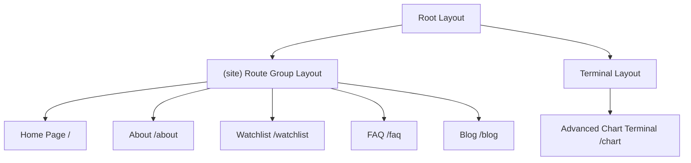

# 📈 Vision Wealth & Institutional Trading Terminal

Welcome to **Vision Wealth**, a professional, institutional-grade financial analysis platform and real-time trading console designed for high-conviction Indian equity investors. 

The application integrates premium mathematical wealth tools (Step-Up SIP, CAGR growth modeling, LTCG tax planners) with a high-performance, real-time charting dashboard inspired directly by TradingView.

---

## ⚡ Key Highlights & Visuals

* **Financial Authority Portal**: In-depth SIP CAGR planning, investment compounding, and tax adjustment modules.
* **Lightweight Charts v5.2 Candlestick Engine**: High-fidelity, real-time interactive charting displaying dynamic OHLCV (Open, High, Low, Close, Volume) bars.
* **Multiple Moving Average (MA) Indicators**: Toggled indicators with customized, high-contrast institutional color styling.
* **P/E Ratio Overlay**: Custom line series mapping price-to-earnings growth over time.
* **Responsive Terminal Grid**: Split-screen side-by-side terminal layout on desktop that shifts to structured sequential modules with touch-safe scrolling selectors on mobile viewports.
* **Centralized Watchlist**: Single source of truth for global equity symbols.

---

## 📐 Project Architecture & Layout Flow

The application uses Next.js Route Groups to cleanly isolate standard descriptive web pages from the full-screen trading console:



### 1. `(site)` Route Group Layout
* Renders global custom `<Navigation />` and `<Footer />` components.
* Contains key informational modules (About, FAQ, Blog) optimized for premium SEO authority and semantic HTML layout.

### 2. `/chart` Console Page
* Standard headers and footers are suppressed to maximize the trading screen footprint.
* Operates as a full-screen, responsive workstation with side-by-side trading controls, real-time watchlists, and live candlesticks.

---

## 🛠️ Technical Stack & Key Dependencies

* **Framework**: [Next.js 16 (App Router)](https://nextjs.org/) utilizing React Server Components (RSC) and React 19.
* **Charting Engine**: [`lightweight-charts` v5.2.0](https://tradingview.github.io/lightweight-charts/) (TradingView's open-source canvas engine).
* **Data Provider**: [`yahoo-finance2`](https://github.com/gadicc/node-yahoo-finance2) for lightning-fast real-time price quotes, historical timelines, and corporate statistics.
* **Styling**: [TailwindCSS v4](https://tailwindcss.com/) + PostCSS compiling custom harmonized dark palettes (`#020617` background).
* **Icons**: [Lucide React](https://lucide.dev/) for terminal vectors and symbols.

---

## 🕯️ Technical Indicators & Moving Averages

The charting interface contains toggleable Moving Average indicators, colored to standard trading console specifications:

| Indicator | Period | Hex Color | Display Name |
| :--- | :---: | :---: | :---: |
| **MA 9** | 9 | `#ffffff` | MA9 (White) |
| **MA 20** | 20 | `#f97316` | MA20 (Orange) |
| **MA 50** | 50 | `#22c55e` | MA50 (Green) |
| **MA 100** | 100 | `#ef4444` | MA100 (Red) |
| **MA 200** | 200 | `#3b82f6` | MA200 (Blue) |

*Features dynamic SMA computation directly in the client container using memory-cached historical arrays.*

---

## 📱 Mobile Responsiveness & Safe Viewports

The charting component features a modern, mobile-first design configured for maximum ease-of-use on all hand-held screen dimensions:

* **Grid Stacking**: Shifting dynamically from a side-by-side desktop view to a mobile structure where the chart holds a minimum layout height of `52dvh` and the watchlist holds a maximum height of `42dvh`.
* **Notch & Safe Margins**: Employs standard safe viewports (`width=device-width, initial-scale=1, viewport-fit=cover`) within the root layout to fully support safe boundary padding on modern edge-to-edge smartphones.
* **Horizontal Scrollbars**: Timeframe selectors and Moving Average buttons scroll horizontally (`overflow-x-auto scrollbar-none`) on small viewports to prevent wrapping and preserve visual consistency.
* **Touch Optimization**: Interactive elements utilize `touch-manipulation` and `shrink-0` classes to support precise tap registration and suppress accidental double-tap browser zoom triggers.

---

## 🌐 Centralized Global Watchlist

Watchlist assets, standard tickers, and market codes are configured globally under **`src/utils/symbols.ts`**:

```typescript
export const WATCHLIST_SYMBOLS = [
  'CGPOWER.NS',  // CG Power
  'VOLTAMP.NS',  // Voltamp Transformers
  'TDPOWERSYS.NS', // TD Power Systems
  'TARIL.NS',    // Transformers & Rectifiers India
  'PRECWIRE.NS', // Precision Wires
  'MAZDOCK.NS',  // Mazagon Dock
  'KIRLOSENG.NS',// Kirloskar Oil Engines
  'HSCL.NS'      // Himadri Speciality Chemical
];
```

*Adding or updating symbols in this file dynamically updates the sidebar list, calculations, and chart APIs across the application when operating in local fallback mode.*

---

## 🗃️ Persistent Watchlist & MongoDB Sync

The Screener Cockpit and Trading Terminal pages are fully integrated with a persistent **Node/Express Mongoose Backend** utilizing MongoDB.

### Key Integration Mechanics:
1. **Dynamic Star Toggles**: Star icons allow you to favorite or unfavorite tickers. Changes perform immediate database `PATCH` mutations and update UI states.
2. **Interactive Ticker Validator**: Adding a ticker validates its statistics through active corporate filings (via `yahoo-finance2`) before executing a `POST` operation to add the verified record to the database.
3. **Resilient Local Fallback**: If the database server is offline or network calls fail, both the Cockpit and Terminal pages seamlessly shift into Local Offline Mode, purge browser cache, and load default institutional quotes with an dynamic warning header.

### Environment Variable Setup
Ensure you create a `.env` file in the root of the `/frontend` directory to target the database API:
```env
NEXT_PUBLIC_API_URL=http://localhost:5001/api
```

---

## 🚀 Getting Started

### 1. Installation
Clone the repository and install the standard development packages:
```bash
npm install
```

### 2. Run the Development Server
Next.js will start a local hot-reloading development server on port `3000`:
```bash
npm run dev
```
Open [http://localhost:3000/chart](http://localhost:3000/chart) to inspect the Trading Terminal live.

### 3. Verification & Lints
Verify project compilation correctness and ESLint parameters before staging commits:
```bash
# Check for code standard errors
npm run lint

# Build production bundle
npm run build
```

---

## ☁️ Deployment Guidelines

The project includes pre-configured settings in **`netlify.toml`** to support serverless deployment pipelines on Netlify:

* **Node Version**: Anchored to **`Node 22`** (via `NODE_VERSION = "22"` environment directives) to suppress dependency warnings from `yahoo-finance2`.
* **Serverless Routes**: Next.js Standalone bundling works out-of-the-box, ensuring zero-config serverless API routing for Watchlist and Chart data streams.

---

*Vision Wealth — Premium financial engineering tools for high-conviction investors. Built for the Indian Equity Market.*
